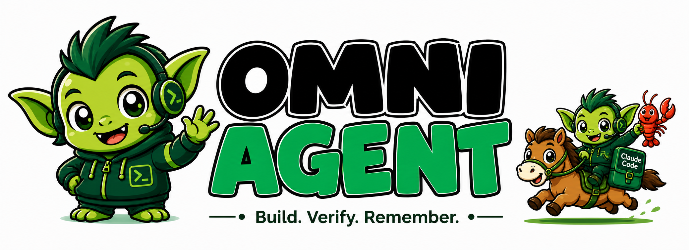

<p align="center">
  <a href="README.zh.md"></a>
  <a href="docs/tutorial/README.zh.md"></a>
  <a href="https://github.com/2830500285/omni-agent/actions/workflows/ci.yml"></a>
  <a href="LICENSE"></a>
  <a href="docs/security.md"></a>
  <a href="examples/evals/suite.json"></a>
  <a href="#运行模式"></a>
</p>

# Omni Agent

语言：[English](README.en.md) | [中文](README.zh.md)

Omni Agent 是一个本地优先的 CLI/TUI 编码 Agent，用于真实仓库里的分析、修改、验证、评测和运行记录。

## 项目主张

Omni Agent 的核心定位是 verification-native multi-agent runtime。任务、子 Agent、记忆、能力声明和运行记录都围绕可复现证据设计，而不是只给出无法验证的功能口号。

五个核心范式见：

- [Omni Agent paradigms](docs/omni-agent-paradigms.md)
- [Verification-native runtime](docs/verification-native-runtime.md)
- [Capability-backed claims](docs/capability-backed-claims.md)
- [Accountable memory](docs/accountable-memory.md)
- [Governed subagents](docs/governed-subagents.md)

## 教程

这套教程不是简单的命令清单，而是按“书”的方式组织的入门材料。它默认读者可能还不了解 Agent runtime、eval harness、model profile、tool calling、benchmark evidence 等概念，所以每一章都会同时解释概念、代码位置和实际操作方法。

从这里开始：

- [英文教程](docs/tutorial/README.en.md)
- [中文教程](docs/tutorial/README.zh.md)

推荐阅读顺序：

1. 先读项目目录地图。你会先知道每个目录负责什么，形成整体心智模型，再开始改代码。
2. 再跑 quickstart 命令。目的不只是把 CLI 启动起来，而是在实际输出里理解 `runtime`、`workspace`、`model profile`、`doctor check` 这些词的含义。
3. 接着读 runtime 运行循环。教程会把一个任务从 CLI 输入开始，一路追踪到模型选择、上下文构造、工具执行、验证命令和持久化 run record。
4. Eval 章节要慢慢读。它会解释 synthetic benchmark、mock runtime check、real-model benchmark 的区别。这个区别很重要：synthetic 高分只能说明 harness、manifest 和评分逻辑没坏，不能说明真实模型完成了任务。
5. 最后做一个小实现练习。新增或修改一个 eval scenario，跑检查，再查看证据。这样才能把 Omni Agent 当成工程系统理解，而不是只把它当作聊天机器人。

教程里会反复出现的核心名词：

- Agent runtime：Agent 的执行循环。它接收任务、准备上下文、调用模型、选择工具、执行安全策略，并记录结果。
- Workspace：Agent 被允许检查和修改的本地仓库或项目目录。
- Model profile：一个命名的模型配置，通常包含 provider 地址、model id、API key 环境变量名、是否支持 streaming、是否支持 tool calling。
- Tool call：模型发起的结构化动作，例如读文件、运行命令、搜索记忆、调用 extension。
- Approval policy：审批规则层。它决定哪些动作可以自动执行，哪些动作必须让操作者确认。
- Trace 或 run artifact：一次任务的证据记录，包括模型回合、工具事件、验证命令、耗时、token usage 和失败原因。
- Eval manifest：定义评测任务的 JSON suite，里面包含 fixture、期望修改文件、必需工具、必需输出片段和评分规则。
- Capability-backed claim：有证据支撑的能力声明。公开说某项能力已经具备时，必须能对应到测试、benchmark scenario、maturity evidence 或 release gate。

读完以后，读者应该能说清楚 Omni Agent 是什么，能在本地运行它，能安全地接入真实模型，能诚实解读 benchmark 结果，并且能用一个小的、可验证的改动扩展系统。

## 快速开始

```bash
npm install
npm run typecheck
npm run dev -- models
npm run dev -- doctor --cwd "."
npm run dev -- run --cwd "." --task "Summarize this repository"
```

如果需要完整构建和测试：

```bash
npm run build
npm test
```

## 常用脚本

```bash
npm run dev -- onboard --storage-root "%USERPROFILE%\\.omni-agent" --default-workspace "E:\\repo"
npm run dev -- setup --storage-root "%USERPROFILE%\\.omni-agent" --default-workspace "E:\\repo" --profile-id primary --protocol openai --base-url "https://api.openai.com/v1" --api-key-env OPENAI_API_KEY --model gpt-4.1-mini
npm run dev -- config
npm run dev -- chat --cwd "E:\\repo"
npm run dev -- models
npm run dev -- evals --cwd "E:\\repo" --manifest ".\\examples\\evals\\suite.json"
npm run dev -- run --task "Summarize this repository"
npm run dev -- doctor --cwd "E:\\repo" --mode openai
npm run dev -- serve --cwd "E:\\repo" --port 4040
npm run dev -- daemon-start --cwd "E:\\repo" --port 4040 --gateway-token local-dev-token
npm test
```

`npm test` 会自动发现 `tests/**/*.test.ts` 下的测试，避免新测试被加入仓库但没有被默认测试路径执行。

## 运行模式

- `mock`：默认模式，不访问远程模型，适合本地脚手架和 runtime 路径验证。
- `openai`：通过 `OMNI_AGENT_BASE_URL`、`OMNI_AGENT_API_KEY`、`OMNI_AGENT_MODEL` 或持久化 model profile 访问真实模型。
- `openai` runtime 支持 OpenAI chat-completions profile，也支持 Anthropic Messages API profile。
- 如果 provider 支持原生 tool calling，runtime 会优先使用原生工具调用。
- `OMNI_AGENT_SUPPORTS_STREAMING=true` 可以请求兼容 provider 的 SSE streaming。
- `OMNI_AGENT_SUPPORTS_TOOLS=false` 可以强制使用 JSON-envelope fallback。
- `OMNI_AGENT_MODEL_PROFILES_JSON` 可以配置多个 OpenAI 兼容 profile，用于 failover routing。
- `npm run dev -- models` 会显示已加载 profile、tool 支持情况和缺失的 API key 环境变量。
- `serve` 会把同一套 runtime 通过 HTTP 暴露出来，用于远程编排和检查。

示例 failover 配置：

```powershell
$env:OMNI_AGENT_MODEL_PROFILES_JSON='[
  {"id":"primary","name":"Claude","protocol":"anthropic","baseUrl":"https://api.anthropic.com","apiKeyEnv":"ANTHROPIC_API_KEY","model":"claude-sonnet-4-5","supportsStreaming":true},
  {"id":"backup","name":"OpenAI","protocol":"openai","baseUrl":"https://api.openai.com/v1","apiKeyEnv":"OPENAI_API_KEY","model":"gpt-4.1-mini","supportsStreaming":true}
]'
```

## CLI 工作流

`onboard` 和 `setup` 用于首次初始化。它们会持久化本地配置、初始化默认 workspace、创建 `AGENTS.md`、`SOUL.md`、`TOOLS.md`、`MEMORY.md`、`USER.md` 等 starter context files，并输出 setup checks。

```bash
npm run dev -- onboard --storage-root "%USERPROFILE%\\.omni-agent" --default-workspace "E:\\repo"
npm run dev -- setup --storage-root "%USERPROFILE%\\.omni-agent" --default-workspace "E:\\repo" --profile-id primary --protocol openai --base-url "https://api.openai.com/v1" --api-key-env OPENAI_API_KEY --model gpt-4.1-mini
```

`chat` 是日常交互式本地 shell。常用 slash commands：

- `/help`
- `/status`
- `/session`
- `/usage`
- `/new`
- `/threads`
- `/history [limit]`
- `/compact [keep-messages]`
- `/resume <thread-id>`
- `/model [profile-id|auto]`
- `/mode <mock|openai>`
- `/domain <workspace|worktree|sandbox>`
- `/verify [command]`
- `/verify-clear`
- `/verification-mode <required|best-effort>`
- `/iterations <n>`
- `/exit`

运行记录会保存 provider/profile、model turn、tool call、成功/失败/被阻止的动作、token usage 和 duration。可以从 `chat /usage`、`show-run`、`show-thread`、`usage --thread-id <id>` 以及 gateway run details 中查看。

## Agent 能力 Profile

Agent 可以从内置 capability profile 创建。Profile 会绑定 role、mode、context engine、memory providers、verification posture、max-iteration budget、默认 instructions 和 tool policy。

内置 profile 包括：

- `claude-coding-operator`：编码、runtime 深度、surgical edits、验证和 repair loop。
- `hermes-self-improver`：memory-first execution、learned skill capture、自我改进行为。
- `openclaw-gateway-operator`：routed inbox、auth/pairing、automations、delivery semantics。
- `review-verifier`：只读 review 和 acceptance checks。
- `research-analyst`：基于源码的仓库发现和对比分析。

使用 `GET /agent-profiles` 查看 profile。`POST /agents` 和 `PATCH /agents/<id>` 支持 `capabilityProfileId`。

## Doctor

`doctor` 是 operator diagnostics。它会检查：

- workspace inspection 和仓库可见性。
- `MEMORY.md`、`USER.md`、`memory/YYYY-MM-DD.md` 等 workspace memory files。
- 本地 SQLite/session storage。
- git 可用性和当前仓库状态。
- OpenAI 兼容 profile 配置和缺失的 API key 环境变量。
- gateway daemon 状态。
- route safety 和 automation 数量。
- extension/plugin directory 解析和加载。

```bash
npm run dev -- doctor --cwd "E:\\repo"
npm run dev -- doctor --cwd "E:\\repo" --mode openai
npm run dev -- doctor --cwd "E:\\repo" --strict
npm run dev -- doctor --cwd "E:\\repo" --fix
```

`doctor --fix` 只自动处理安全的小修复，例如生成缺失的 gateway token、恢复 starter workspace files、清理 stale daemon state、迁移 legacy routes。它不会编造 API key、webhook URL，也不会覆盖明确设置为 open 的 routes。

## Evals

`evals` 通过 manifest-driven task suites 运行正常 runtime，并汇总：

- completion rate
- first-pass rate
- verification failure 后的 repair rate
- average tool calls
- long-context state retention rate
- 基于 eval program spec 的 release-decision readiness

默认 suite 覆盖这些核心类别：

- `single_agent_bugfix`
- `multi_agent_investigation`
- `long_context_modification`

每个 scenario 可以包含多个 step，以及 verification status、required changed files、required tool names、required response snippets 等期望。多 step scenario 会复用同一个 thread，从真实状态延续中衡量 long-context retention。

`npm run eval:benchmark` 默认使用 `--mode synthetic`。它是快速 harness 和 manifest 回归检查，只证明 benchmark wiring、scoring 和 capability gates 没坏，不代表真实模型完成了所有任务。

真实模型 benchmark 示例：

```bash
npm run eval:benchmark -- --mode openai --model-profile primary --max-iterations 8
```

Mock runtime benchmark 适合不花远程模型成本地验证 runtime 路径：

```bash
npm run eval:benchmark -- --mode mock --no-save
```

运行结果会保存到 `.artifacts/benchmarks/runs/<run-id>/`，并更新 `.artifacts/benchmarks/history.json`、`trend.json`、`latest.json` 和 `report.md`。这些 artifacts 不应提交到 git。

## Capability-backed claims

公开能力声明记录在 `docs/capability-backed-claims.md`，并由 `npm run maturity:check` 验证。每条声明都应该映射到 scorecard capability、benchmark scenario 和 maturity evidence。

```bash
npm run maturity:check
```

没有证据支撑的成熟能力声明会失败；有支撑但还不成熟的能力会被报告为风险。

## Workspace memory files

Omni Agent 可以读取 Hermes/OpenClaw 风格 workspace 里的 file-backed memory。每次运行会安全截断并加载：

- `MEMORY.md`
- `USER.md`
- `memory/*.md`

相关命令：

```bash
npm run dev -- memory-save --cwd "E:\\repo" --content "Use npm run build before shipping" --tag build
npm run dev -- memory-search --cwd "E:\\repo" --query "shipping"
```

设计要求：记忆必须对当前任务有用，过期记忆不能覆盖当前源码。

## Workspace instruction files

Workspace instructions 用来把项目约定带进 runtime。常见文件：

- `AGENTS.md`
- `CLAUDE.md`
- `TOOLS.md`
- `SOUL.md`
- `USER.md`

`onboard` 和 `setup` 会创建 starter files。已有项目里的真实说明优先于模板。

## Workspace skill directories

Omni Agent 可以发现 workspace 内的 skill directory，用于把可复用操作经验变成运行时可检索的能力材料。相关命令：

```bash
npm run dev -- skills --cwd "E:\\repo" --query "verification"
```

## External docs

外部文档集中放在 `docs/`，包括：

- `docs/security.md`
- `docs/operations.md`
- `docs/release-checklist.md`
- `docs/live-testing.md`
- `docs/product-parity-dashboard.md`
- `docs/capability-backed-claims.md`

这些文档应该服务于可执行命令、测试、eval 或发布门禁，避免只写路线图式描述。

## Local extensions

Local extensions 允许从插件目录加载本地能力。常用命令：

```bash
npm run dev -- extensions --cwd "E:\\repo" --plugin-dir ".\\examples\\plugins"
npm run dev -- doctor --cwd "E:\\repo"
```

Extension manifest 或 module load 出错时，`doctor` 会给出诊断。

## Coordinator and swarms

Coordinator 和 swarm 能力用于多 Agent 编排。设计重点不是创建更多并发线程，而是明确：

- 每个 Agent 的职责。
- 文件或能力边界。
- 执行预算。
- 审批策略。
- 返回证据。
- 父任务如何合并结果。

相关文档：

- `docs/governed-subagents.md`
- `docs/agent-run-artifacts.md`

## Route adapters

Route adapters 支持 Slack、Discord、Telegram、filesystem、webhook 等通道的 inbound/outbound 工作流。创建 route 示例：

```bash
npm run dev -- route-create --cwd "E:\\repo" --title "Slack triage" --channel-type slack --channel-key C12345 --adapter-type filesystem --outbox-dir ".\\outbox" --inbound-secret route-secret
npm run dev -- routes --cwd "E:\\repo"
npm run dev -- deliveries --cwd "E:\\repo"
```

生产环境不要把真实 bot token、webhook URL 或 inbound secret 提交到仓库。

## Learned skills

Learned skills 用来沉淀可复用的操作模式。它们应该来自真实任务、真实失败和真实修复，而不是空泛总结。

好的 learned skill 应该包含：

- 触发场景。
- 操作步骤。
- 验证命令。
- 常见失败。
- 不应使用的边界。

## HTTP gateway

Gateway 把 runtime 暴露为本地 HTTP/SSE/WS 服务，支持 remote orchestration、实时事件、async jobs、memory、automation 和 node control-plane sessions。

```bash
npm run dev -- serve --cwd "E:\\repo" --port 4040 --gateway-token local-dev-token
npm run dev -- daemon-start --cwd "E:\\repo" --port 4040 --gateway-token local-dev-token
npm run dev -- daemon-status
npm run dev -- daemon-stop
```

建议始终配置 `OMNI_AGENT_GATEWAY_TOKEN` 或传入 `--gateway-token`，避免 gateway API 裸奔。

## 当前范围

Omni Agent 当前最适合的定位是本地优先的 coding-agent runtime 和 eval harness：

- 能运行仓库任务。
- 能保存 run/thread/tool/model 证据。
- 能通过 doctor 做 operator diagnostics。
- 能用 synthetic/mock/openai 三种模式区分 harness 回归、runtime 路径验证和真实模型评测。
- 能用 capability-backed claims 约束公开能力声明。

还不应把 synthetic benchmark 的高分宣传成真实模型能力。真实能力需要带 model profile、trace、cost、duration、失败原因和 verification evidence 的 openai-mode benchmark 支撑。

## 安全提示

- 不提交真实密钥。
- 不提交完整且逼真的假密钥。
- 不提交 `.artifacts`、`.tmp`、`.agents`、`node_modules`、provider traces、本地 runtime stores。
- 任何工具执行、路径访问、prompt injection、credential exfiltration 都应该有明确测试或审批边界。

常用验证：

```bash
npm run typecheck
node ./scripts/run-tests.mjs tests/safety.test.ts
npm run eval:smoke
npm run eval:benchmark -- --mode synthetic --no-save
```
